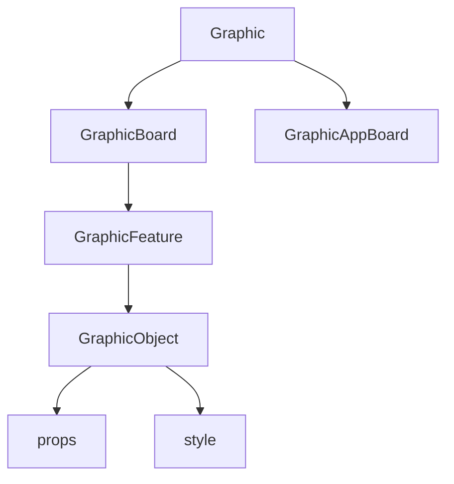

# GRAPHIC (투명도와 도형들)

<br>
<br>

## Graphic 개요

- 그래픽(Graphic)이란 D2에서 만든 개념으로 투명도(Overlay Layer)의 생성 및 개별 Layer 내부에 위치하게 되는 각종 도형 및 군대부호들을 관리하는 class입니다.
- `window.graphic`을 크롬 등 브라우저 내 개발자 콘솔에서 열고 타이핑해보시면 그 안에 무엇이 들어있는지 확인하실 수 있으며, 해당 클래스에 대한 property 및 method 정리는 [src/types/d2/index.d.ts](../src/types/d2/Graphic.ts) 파일을 참고해보세요.
- Graphic class의 구조는 다음과 같습니다.
  <br>
  <br>



<br>
<br>

### 개별 개념 정리

  <br>
  <br>

#### Graphic

<br>

- Graphic 클래스는 `src/libs/d2/setupMap.ts`에서 최초로 맵을 생성할 때 함께 생성되는 class로, 해당 class가 없이는 투명도를 생성할 수 없습니다. 아래 코드와 같이 window 객체에 graphic이 생성된 이유는 D2 라이브러리와의 호환 때문입니다.
  <br>
  <br>

```ts
// 새로운 graphic 객체 생성
window.graphic = new Graphic(window.map);
// 최초로 띄울 board(즉 layer)의 생성 시 기본 이름 설정. setName의 값을바꾸면 이름이 바뀜
window.graphic.getSelectGraphicBoard().setName("overlay-1");
window.graphic.loadStdXSD(urlInfo.graphic.overlay); // 투명도 스키마
window.graphic.setCursor(cursor); // 커서 세팅
```

src/libs/d2/mapSettings/setupMap.ts

- 이렇게 최초 맵 객체 생성 시 graphic을 함께 생성해주면 투명도를 설정할 준비가 끝난 것입니다.
- graphic이 생성되면서 내부적으로 이미 1개의 layer(또는 board)가 생성되어 있으며, 현재 이 안에는 어떤 도형도 들어있지 않은 상태일 것입니다.
- graphic은 많은 properties와 method를 가지고 있지만 가장 주요한 것은 `GraphicBoard`와 `GraphicAppBoard`의 핸들링입니다.
- 주지할 것은 graphic은 GraphicBoard 내에 존재하는 각종 도형들에 대한 제어까지도 담당한다는 것입니다. 아래에서 구체적으로 살펴보겠습니다.
  <br>
  <br>
  Graphic에서 할 수 있는 일
  |method | 하는 일 |
  |---|---|
  | board(layer)관리 | 보드의 추가, 삭제, 순서 변경, 특정 보드를 선택하는 행위 등 |
  | object(feature) 생성 | 선택된 특정한 1개 보드 내의 특정한 object(도형, 군대부호류) 를 생성하는 행위 |
  | object(feature) 삭제 | 선택된 특정한 1개 보드 내의 특정한 object(도형, 군대부호류) 를 삭제하는 행위 (이때 \_selectObjectManager가 필요해짐) |
  | object류 호출 | 선택된 특정한 1개 보드 내에 속해있는 object류의 목록을 불러옴 |
  | object류 zIndex 설정 | 선택된 특정한 1개 보드 내에 속한 object류의 표시 순서를 바꿈|

<br>
<br>

#### GraphicAppBoard

<br>
- D2에서는 이를 다음과 같이 말하고 있습니다만, 무슨 뜻인지 전혀 알 수가 없습니다. 추후에 다시 살펴보겠습니다.
<br>
<br>

> 그래픽 APP 보드(레이어)는 사용자 마우스 이벤트가 없는 그래픽 객체 생성 및 관리기능을 제공한다.

<br>
<br>

#### GraphicBoard

<br>

- GraphicBoard란 하나의 Layer, 즉 투명도 또는 Overlay, Board 등등으로 표현할 수 있는 <b>각종 도형이나 군대부호 등을 특정 좌표에 배치한 묶음 그 자체</b>를 의미합니다. 이 부분에 대하여 이해가 잘 가지 않으신다면 [지도개요](MAP.md)를 읽어보시길 바랍니다. 앞으로 Layer라고 하겠습니다.

- 마치 포토샵에서 레이어를 추가한 뒤 그 레이어 위에 각종 도형이나 색칠, 사진 등을 올려서 편집할 수 있는 것처럼, 이 개념은 어떻게 보면 도형류를 하나의 그뤂핑한 것과 비슷합니다. 만약 포토샵에서 새로운 레이어를 추가하면 기존의 레이어는 새로운 레이어 아래에 깔리게 되고, 새로운 레이어에 커다란 도형 같은 것을 그려넣으면 그 아래에 있는 것은 보이지 않게 되겠지요? 포토샵에서 눈알 모양을 눌러 보이기/가리기 등 행위를 레이어에 대고 하면 그 레이어는 묶음으로서 한 번에 가려지거나 보여지거나 할 수 있게 됩니다. 이와 아주 유사한 개념입니다.

- 단, 레이어 내에서도 어떠한 도형들만 따로 묶어서 그룹화 할 수도 있겠죠? 이것은 GraphicBoard 내에서 일어나는 일이지 GraphicBoard 그 자체가 그룹이다라는 것은 아니라는 것입니다. 파워포인트를 비유로 들자면 특정한 1page 시트를 1개의 레이어라고 본다면, 한 장의 시트 안에서 각종 표나 그림들을 하나로 묶어 그룹핑 할 수 있는 것과 마찬가지입니다. 그룹핑을 했다고 해서 레이어(페이지 시트)의 속성이 바뀌는 것은 아닌 것처럼 말입니다.

- 당연하게도 이러한 레이어는 여러 개일 수 있습니다. 어떤 것이 위에 있고 아래에 있냐는 zIndex로 제어합니다.

- 이미 Graphic 객체를 생성하면서 1개의 layer가 생성되었다고 했습니다. 그럼 그 레이어가 생성이 되어 있는지 확인해보겠습니다.
  <br>
  <br>

```ts
const defaultLayerList = graphic._graphicBoard;
```

modules/map/layer/FeatureLayerHandler.tsx

<br>
<br>
또는 개발자콘솔에 `window.graphic`이라고 치고 그 안의 `_graphicBoard`를 눌러보세요. 레이어 목록이 Array로 보여집니다.
<br>
<br>

- `_graphicBoard` 내에는 다양한 properties와 method들이 존재하는데(types/d2/Graphic.ts 내에서 IGraphicBoardf를 찾아보세요), 그 method들은 개별 layer에 대한 다음의 핸들링만 가능합니다.
  <br>
  <br>
  graphicBoard 내에서 할 수 있는 일
  |method | 하는 일 |
  |---|---|
  | visible류 | 해당 레이어를 지도에서 보여줄지 말지를 결정 |
  | name류 | 해당 레이어의 이름을 바꿈 |
  | Object류 | 해당 레이어의 하위에 어떤 도형류들이 들어있는지 확인 (확인만 가능하고 도형류 전반에 대한 제어는 graphic에서 해야 함) |
  | zIndex류 | 해당 레이어의 zIndex가 전체 GraphicBoard 내에서 어떤 순서를 가지는지 확인 및 이를 바꿈 |
  | 파일 변환류 | 해당 레이어를 json이나 xml 형태로 바꿔 파일로 저장하거나 불러올 수 있게 함 |
  <br>
  <br>
- 그러면 이번엔 레이어를 하나 더 추가하는 로직을 살펴보겠습니다. 레이어는 추가는 당연히 더 상위로 올라가 `graphic`의 method로 생성해야 합니다.
  <br>
  <br>

```ts
// 보드 1개 더 추가함. 추가가 되면 그것의 index를 불러옴. 만약 두 번째 레이어라면 1이 될 것임.
const index = graphic.addGraphicBoard(); // 1
// 그 레이어를 선택함.
graphic.setSelectGraphicBoard(index);
```

modules/map/layer/FeatureLayerHandler.tsx

 <br>

- 여기서 살펴볼 것은 `setSelectGraphicBoard`로, 이 method는 특정한 보드를 <b>선택</b>한다는 행위입니다. 선택을 한다는 것은, 지도 위에 도형을 그렸을 때, 그 도형이 어떠한 Layer(graphicBoard)에 속하게 할 것인가, 또는 어떠한 레이어를 저장할 것인가 등의 활성화된 레이어가 무엇인지를 확인하고 그 레이어에 어떠한 행위를 하기 위해 필요한 method입니다.
- 그러면 현재 어떤 레이어가 선택되어 있는 것인지를 확인하기 위해선 `getSelectGraphicBoard`를 호출합니다.
- 레이어를 삭제하려면 어떻게 할까요? 역시 상위로 올라가 `graphic.removeGraphicBoard(삭제할 index)`를 호출하시면 됩니다.

#### GraphicFeature / Object

- Feature는 Object의 상위 개념처럼 보이긴 하는데, 코드 내에서 혼용되어 사용되고 있습니다. 여기서는 그냥 Feature라고 하겠습니다.
- Feature는 특정한 GraphicBoard 내에 속해있는 각종 도형류, 군대부호류, 이미지류, 텍스트류 등을 포괄하는 개념입니다. 하나의 GraphicBoard 안에는 다수의 Feature가 Array의 형태로 저장되어 있으며, zIndex로 순서를 조율합니다.
- Feature 목록에 접근하려면 아래와 같이 호출해야 합니다. 놀랍게도, `graphic._graphicBoard` 안에는 feature list를 조회할 수 있는 properties가 없습니다!

```ts
// 선택되어 있는 보드(layer)를 가져옴.
const board = graphic.getSelectGraphicBoard();
// 그 보드 내의 objectList를 가져옴.
const objList = board.getParentObjectList(); // 또는 board.getObjectList()
```

modules/map/layer/FeatureLayerHandler.tsx

- `getParentObjectList()` 또는 `getObjectList()`를 호출하여 feature list를 반환받습니다. 앞선 두개의 차이가 대체 뭘까요? 최상위 어쩌고가 Parent라는데 현재로선 알 수가 없습니다. (ObjectList의 호출은 내부적으로 ol 내 getFeatures()를 활용한 것으로 보임 - 암튼 두개의 차이는 GraphicUtil.getObjParent를 활용하느냐 마느냐의 차이임 - 그렇다면, 객체가 그룹일 때, 그룹의 최상위 이름?를 가져온다는 것으로 이해하면 될까?)
